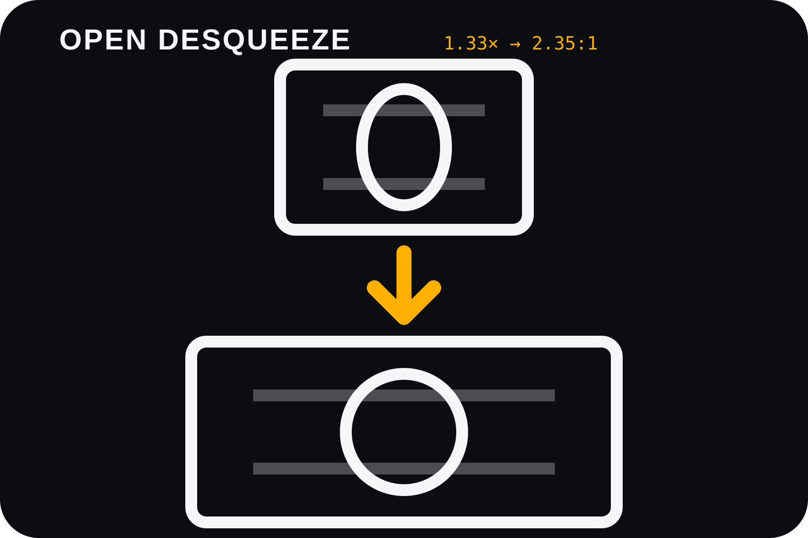

<div align="center">



# OpenDeSqueeze

**Local-first batch anamorphic desqueeze for Android photos and video.**

[繁體中文](README.zh-TW.md) · [Architecture](docs/ARCHITECTURE.md) · [Build](BUILDING.md) · [Contributing](CONTRIBUTING.md)


</div>

OpenDeSqueeze is a small Android utility for correcting footage shot through anamorphic lenses. It batch-processes photos and videos on-device, without uploading media and without bundling FFmpeg.

It is intentionally narrow in scope: **select media → choose the squeeze factor → preview output geometry → export**.

## Features

- Multi-select photos and videos with Android's Storage Access Framework.
- Presets for **1.33×, 1.50×, 1.55×, 1.80×, 2.00×**, plus custom **1.01–3.00×**.
- **Preserve Width** mode, recommended for mobile hardware encoders.
- **Preserve Height** mode when expanding horizontal resolution is acceptable.
- Batch photo export: JPEG, PNG, WebP Lossless.
- Video export: H.264/AVC, H.265/HEVC, and AV1 where the platform supports MP4 AV1 muxing.
- Runtime codec discovery instead of hard-coding Snapdragon, Dimensity, or Exynos codec names.
- Hardware-first codec selection with software fallback where the device exposes it.
- Original compressed audio can be copied without re-encoding.
- Android foreground media-processing service for long-running jobs.
- No Internet permission. Media stays on the device.

## Geometry

For a 1.33× anamorphic source:

```text
3840 × 2160 squeezed
        │
        │ 1.33× desqueeze
        ▼
Preserve Width
3840 × 1624
≈ 2.36:1
```

Preserve Width avoids generating a ~5108-pixel-wide stream from a 3840×2160 input, which improves the chance of remaining inside mobile hardware encoder limits.

## Media pipeline

```text
Storage Access Framework
        │
        ▼
SelectedMedia + ExportSettings
        │
        ▼
ProcessingService
        │
        ├────────────── Photos ──────────────┐
        │                                    ▼
        │                               PhotoProcessor
        │                                    │
        │                                    ▼
        │                              MediaStoreWriter
        │
        └────────────── Video ───────────────┐
                                             ▼
                                      MediaExtractor
                                             │
                                             ▼
                                      MediaCodec decoder
                                             │
                                             ▼
                               SurfaceTexture / OpenGL ES
                                             │
                                             ▼
                                      MediaCodec encoder
                                             │
                                             ▼
                                         MediaMuxer
                                             │
                                             ▼
                                      MediaStoreWriter
```

More detail: [docs/ARCHITECTURE.md](docs/ARCHITECTURE.md).

## Codec policy

`Auto` currently prefers:

```text
hardware HEVC
    ↓ fallback
hardware AVC
    ↓ fallback
software HEVC
    ↓ fallback
software AVC
```

OpenDeSqueeze queries `MediaCodecList` and checks target dimensions at runtime. If a codec advertises support but fails during configuration/start, the transcoder moves to the next candidate.

NPU video encoding is not exposed as a portable Android API. OpenDeSqueeze therefore uses Android's standard MediaCodec abstraction, which lets the platform route work to vendor video hardware.

## HDR

HDR support is **experimental** in v0.1.x.

The app detects common HDR transfer metadata and blocks HDR processing by default. Experimental mode forwards metadata where possible, but the current OpenGL ES path is not claimed to be a validated 10-bit HDR pipeline.

## Privacy

OpenDeSqueeze does not request `INTERNET`.

Your source files are read through Android's media/document APIs and outputs are written to the device's media store. There is no account, analytics SDK, cloud processing service, or remote upload path in the current project.

## Install / build

The latest public preview is available from GitHub Releases. It is still debug-signed while stable release signing is being prepared.

You can:

1. Download [OpenDeSqueeze v0.1.1](https://github.com/juhjuhx/OpenDeSqueeze/releases/tag/v0.1.1), or
2. Build locally using [BUILDING.md](BUILDING.md).

A stable release signing workflow is planned before a formal 1.0 release.

## Contributing

Forks, bug reports, device compatibility reports, and pull requests are welcome.

See:

- [CONTRIBUTING.md](CONTRIBUTING.md)
- [CODE_OF_CONDUCT.md](CODE_OF_CONDUCT.md)
- [SECURITY.md](SECURITY.md)
- [CONTRIBUTORS.md](CONTRIBUTORS.md)

Useful reports include phone model, Android version, SoC, source codec, source dimensions, squeeze factor, export codec, and the exact failure message.

## License

OpenDeSqueeze is licensed under the **GNU General Public License v3.0 (GPL-3.0)**. See [LICENSE](LICENSE).

GPL does **not** mean “nobody may use this.” It allows use, study, modification, forks, and redistribution under the license terms. If you distribute covered modified versions or binaries, GPLv3 imposes source-code and licensing obligations. In practical terms, do not take GPL-covered OpenDeSqueeze code, distribute a closed-source derivative, and ignore the license.

## Credits and research

OpenDeSqueeze v0.1 is a clean-room implementation built on Android framework APIs. Open-source projects that informed product or architecture research are listed in [THIRD_PARTY_NOTICES.md](THIRD_PARTY_NOTICES.md). Those projects are **references/inspirations**, not automatically contributors to this repository.

---

**Current status:** functional v0.1 Android prototype with successful on-device photo/video transcoding and a working GitHub Actions build pipeline.
